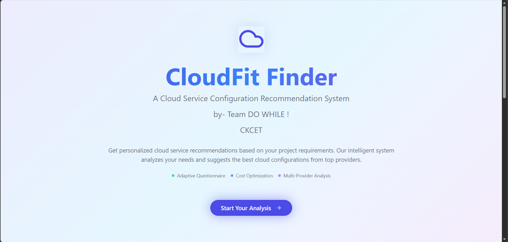
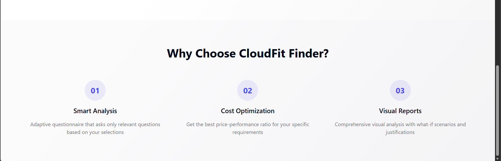
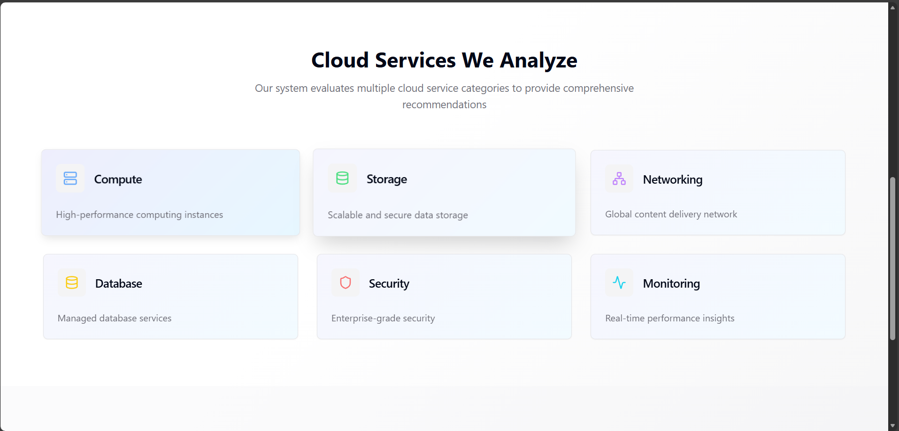
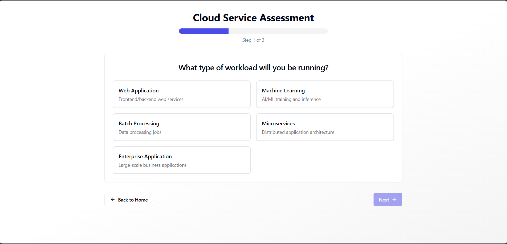

🌩️ Automated-analysis-of-cloud-server-configuration (Cloud Fit Finder)

Cloud Fit Finder is a rule-based cloud recommendation web application that helps users choose the best-fit cloud services (AWS / Azure / GCP) based on their requirements — such as compute needs, storage, database, security, cost, and scalability.

The app minimizes user effort by using adaptive questioning (MCQ/MSQ) and a scoring-based recommendation engine to suggest optimized cloud services instead of forcing users to answer long questionnaires.

## 📸 Screenshots

🚀 Key Features

🔍 Cloud Recommendation Engine

Suggests optimal Compute, Storage, Database, Networking, Security services

Supports AWS, Azure, and GCP

Uses rule-based + weighted scoring logic

🧠 Smart Question Flow

Asks only necessary questions

Dynamically decides the next question based on previous answers

Reduces user input time

📊 Scoring-Based Ranking

CPU, RAM, Cost, Compliance, Scalability scores

Produces ranked recommendations with justification

🔐 Supabase Integration

Authentication

Data storage (user responses, recommendations)

🎨 Modern UI

Built with React + TypeScript

Styled using Tailwind CSS

Toast notifications and responsive design

🏗️ Project Structure
cloud-fit-finder/
│
├── public/                     # Static assets
│
├── src/
│   ├── components/             # Reusable UI components
│   ├── hooks/                  # Custom React hooks
│   │   ├── use-mobile.tsx
│   │   └── use-toast.ts
│   │
│   ├── integrations/
│   │   └── supabase/            # Supabase client & helpers
│   │
│   ├── lib/                     # Utility functions & logic
│   ├── pages/                   # Application pages / views
│   │
│   ├── App.tsx                  # Root component
│   ├── App.css
│   ├── main.tsx                 # Entry point
│   ├── index.css
│   └── vite-env.d.ts
│
├── supabase/                    # Supabase configuration
│
├── .env                         # Environment variables
├── .gitignore
├── package.json
├── package-lock.json
├── bun.lockb
├── tailwind.config.ts
├── postcss.config.js
├── tsconfig.json
├── tsconfig.app.json
├── tsconfig.node.json
├── eslint.config.js
├── components.json
├── index.html
└── README.md

🧩 Tech Stack
Frontend

React + TypeScript

Vite

Tailwind CSS

Shadcn/UI (components.json)

Backend / Services

Supabase (Auth + Database)

Rule-based recommendation logic (client-side / lib)

⚙️ Recommendation Logic (High Level)

User answers MCQ / MSQ questions

Answers are mapped to weights

Each cloud service gets scores:

CPU Score

RAM Score

Cost Score

Compliance Score

Scalability Score

Total Score is calculated

Services are ranked and shown with justification

Example output:

Rank	Provider	Service	Total Score	Reason
1	AWS	EC2 m6i.large	88.7	Best cost-to-performance
2	GCP	n2-standard-4	84.5	Better for scaling
3	Azure	D2s v3	82.1	Balanced option
🔐 Environment Variables

Create a .env file in the root:

VITE_SUPABASE_URL=your_supabase_url
VITE_SUPABASE_ANON_KEY=your_supabase_anon_key

▶️ Running the Project
Install dependencies
npm install
# or
bun install

Start development server
npm run dev
# or
bun dev

App will be available at:

http://localhost:5173

📌 Future Enhancements

🔄 Real-time pricing fetch from AWS / Azure / GCP APIs

🤖 ML-based recommendation (hybrid with rule engine)

📈 Cost simulation dashboard

📄 Export recommendations as PDF / report

🌍 Region-based optimization

🧪 A/B testing for question flow

👩‍💻 Author

Monasri
B.Tech – Artificial Intelligence & Data Science
Focused on Cloud Computing, AI Systems, and Recommendation Engines

⭐ If you like this project

Give it a ⭐ on GitHub and feel free to fork & extend it!
